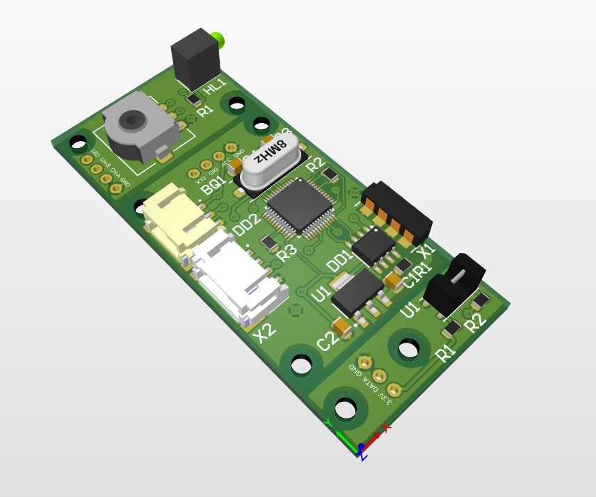
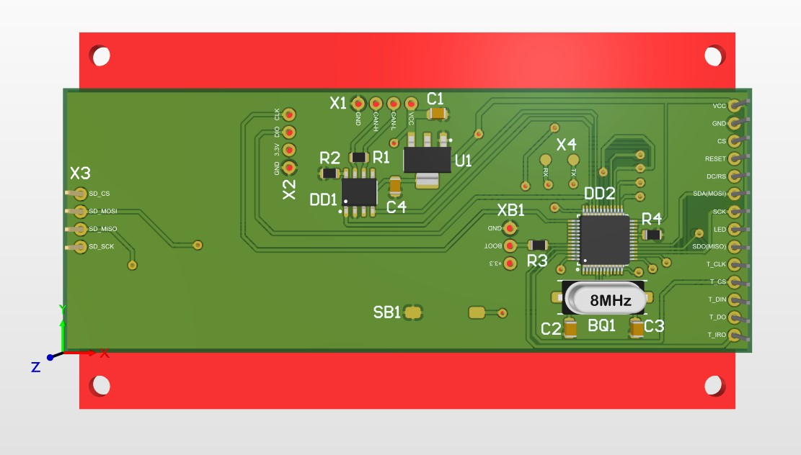

# Автоматизированная система адресного хранения SMD-компонентов

Аппаратно-программный комплекс для автоматизации учета и быстрого поиска SMD-компонентов в ячейках хранения. Система состоит из центрального блока управления (с экраном и тачскрином) и ведомых модулей ячеек, объединенных по шине CAN.

---

## 📸 Визуализация проекта

| 3D-модель платы ячейки хранения (Altium) | 3D-модель платы блока управления (Altium) |
| :---: | :---: |
|  |  |

| Сборочная модель (КОМПАС-3D) |
| :---: |
|  |

---

## 🛠 Технические характеристики и стек

### Аппаратная часть:
* **Микроконтроллер:** STM32F103 (ядро ARM Cortex-M3).
* **Дисплей:** TFT ILI9488 (320x480, интерфейс SPI/параллельный).
* **Сенсорная панель:** Резистивный тачскрин XPT2046 (интерфейс SPI).
* **Интерфейсы связи:** CAN (Controller Area Network).
* **Хранение данных:** SD-карта (подключение по SPI).
* **Проектирование плат:** Altium Designer (двухслойная печатная плата).

### Программная часть:
* **Язык программирования:** C.
* **Уровень абстракции:** CMSIS (разработка без использования библиотек HAL/LL).
* **Среда разработки:** STM32CubeIDE.
* **Использованные сторонние библиотеки:**
  * [FatFs](https://github.com/abbrev/fatfs) — для работы с файловой системой FAT на SD-карте.
  * [MiniINI](https://github.com/compuphase/minini) (или аналогичный парсер) — для чтения/записи конфигурационных ini-файлов.
